# パラパラ漫画風アプリを作ろう

### 目標  
storyboardとviewControllerを扱うことで画像を配置した画面遷移を行うことができるアプリの作成

### 工程  
1. プロジェクトの作成  
2. storyboardでレイアウト作成  
3. 画像ファイルの配置  
4. UIPageViewControllerの作成  
5. viewControllerの生成
6. imageViewに画像を設定
7. ページ遷移の操作

---

#### 1.プロジェクトの作成  
* Single View Appを選択  
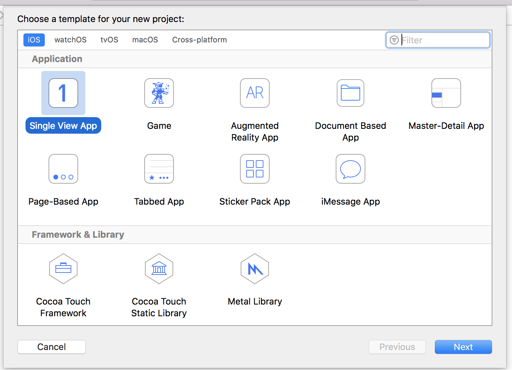</img>  

</br>

* project_name名を設定  
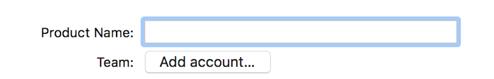</img>  

</br>

* Device Orientationでportraitを外す ==> ** 横画面指定に **  
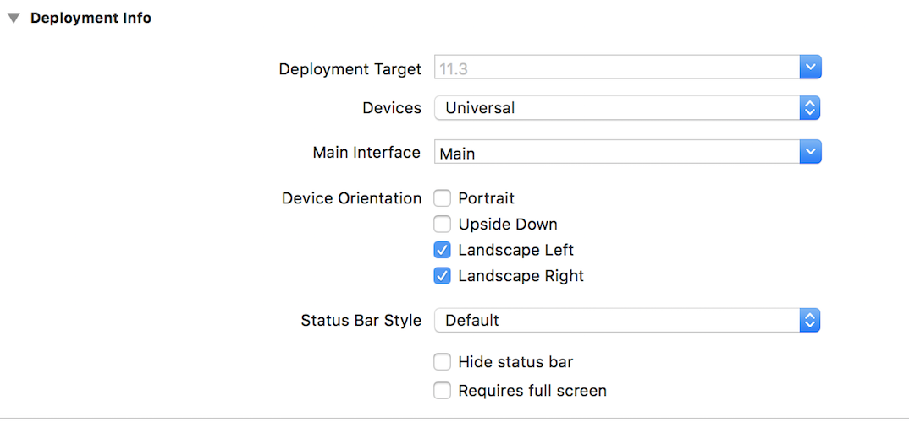</img>  

</br>

#### 2.storybordyでレイアウト作成  
* 横配置設定に変更   
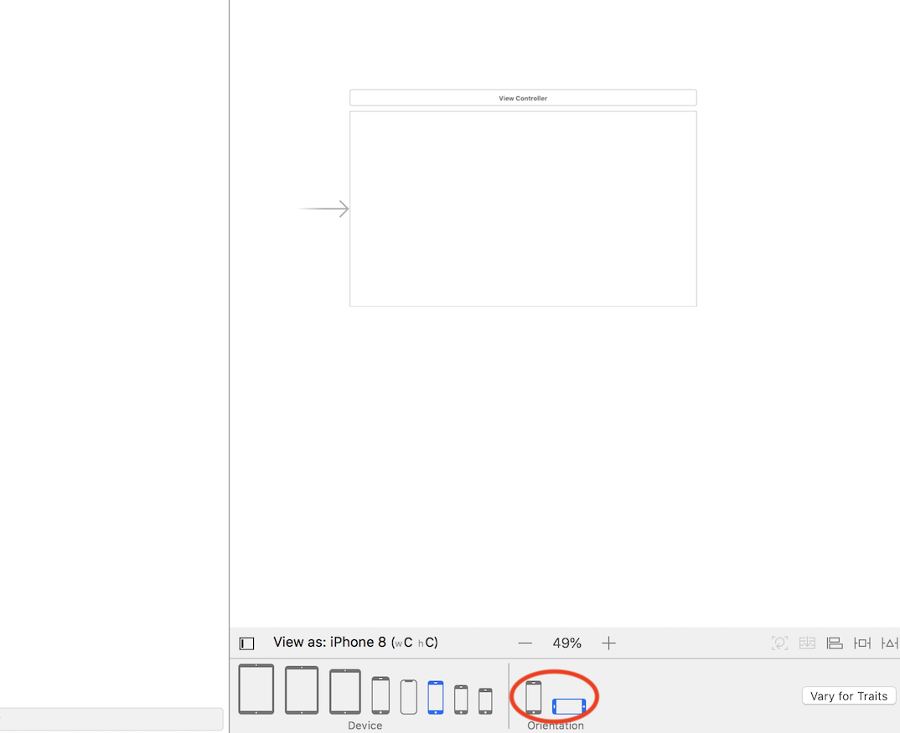</img>

</br>

* image Viewを設定  
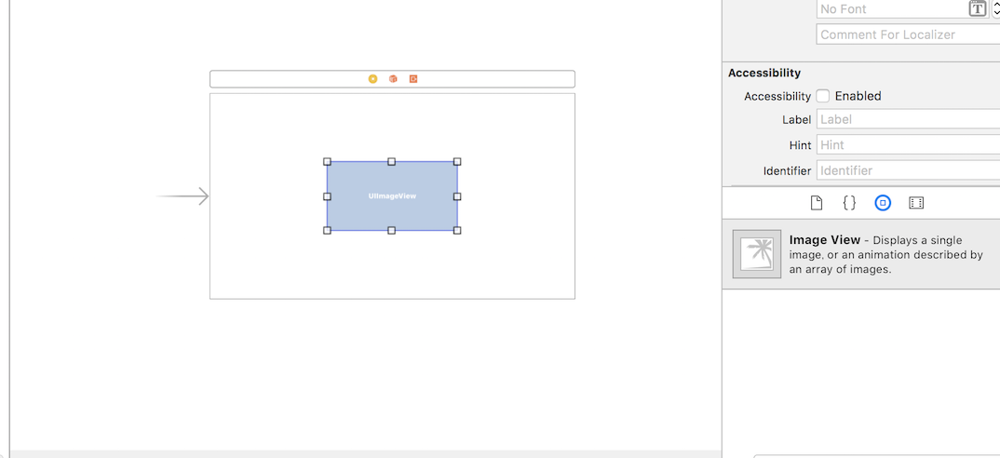</img>  

</br>

* image Viewを中央に配置   
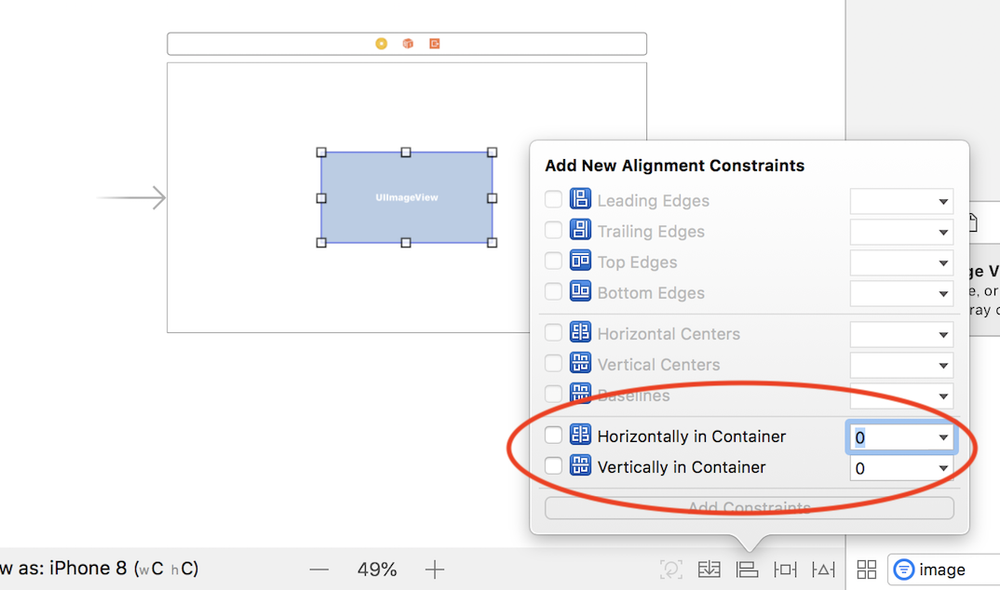</img>  

</br>

* image Viewを画面いっぱいに配置    
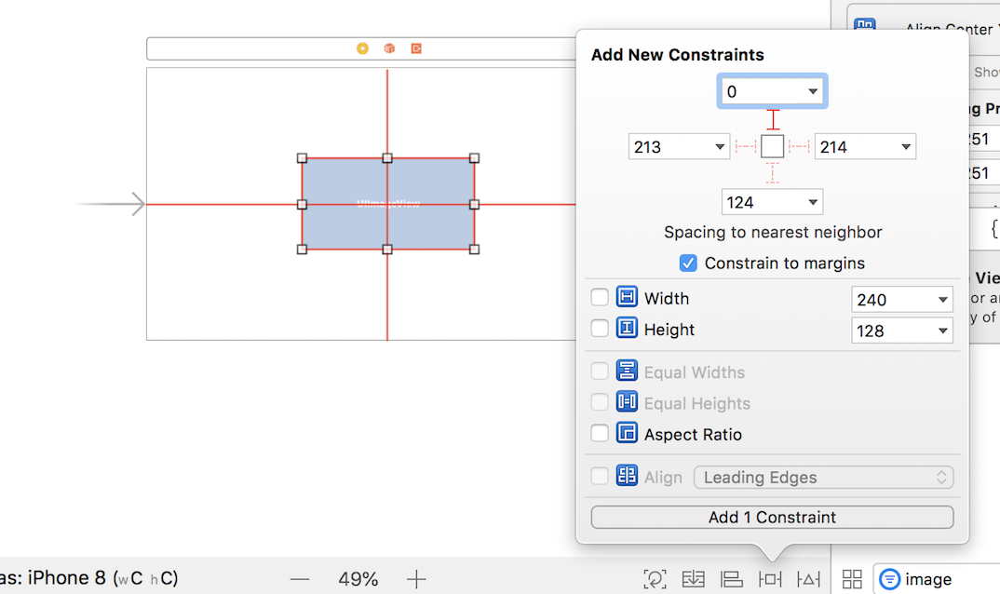</img>  

</br>

#### 3.画像ファイルの配置  
*  Assets.xcassetsに画像を設定  
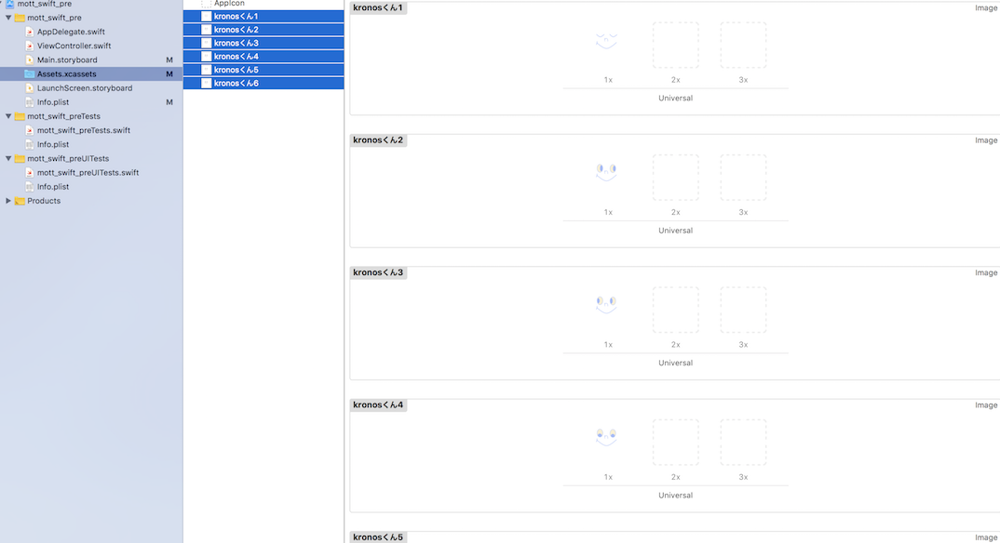</img>

</br>

* storybordとコードを紐付ける   
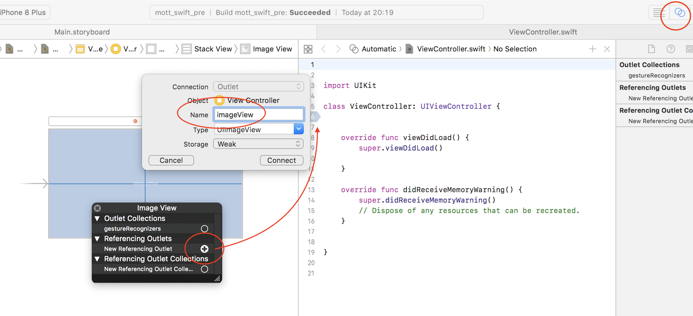</img>  

```swift
@IBOutlet weak var imageView: UIImageView!
```  

</br>

#### 4.UIPageViewControllerの作成
*  storyboard上にpageViewContorllerを配置  
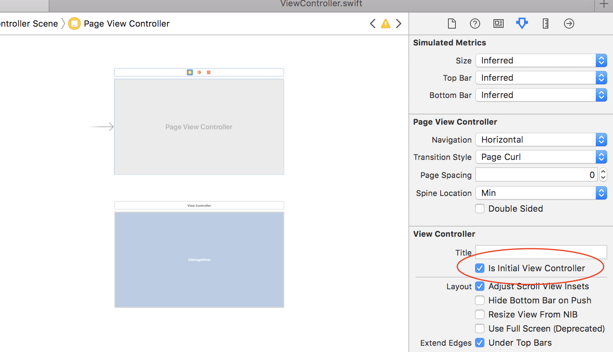</img>

</br>

* UIPageViewControllerのサブクラスを作成    
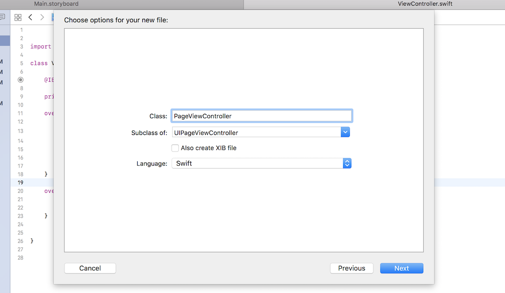</img>  

</br>

* storyboardとクラスを紐付ける    
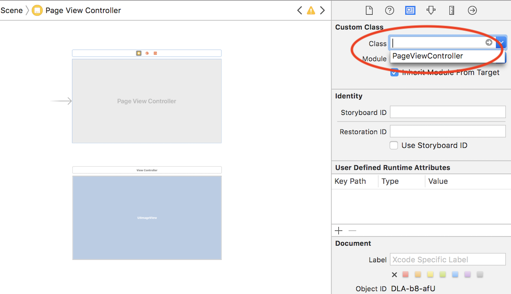</img>  

</br>

#### 5.viewControllerの生成  
* 後で使用する変数を定義  
``` swift
  //ページ番号
  var viewControllerIndex : Int = 0

  //画像の名前を格納
  let imageNames: [String] = ["kronosくん1", "kronosくん2", "kronosくん3", "kronosくん4","kronosくん5","kronosくん6"]

  //viewControllerを格納
  var targetViewControllers : [UIViewController] = []
```  

* storyboardのviewControllerをインスタンス化  
``` swift
override func viewDidLoad() {
  super.viewDidLoad()

  // 表示用ViewControllerを生成
  for i in 0..<imageNames.count {
    let viewController = UIStoryboard(name: "Main", bundle: nil).instantiateViewController(withIdentifier: "vc") as! ViewController

  //viewControllerを追加
    targetViewControllers.append(viewController)
  }
  // Do any additional setup after loading the view.
self.setViewControllers([targetViewControllers[0]], direction: .forward, animated: true, completion: nil)

  //自身を格納
  self.dataSource = self

  }
```  
</br>

#### 6.imageViewに画像を設定  
* viewControllerの初期表示を設定  
``` swift
private var imageName: String?  
override func viewDidLoad() {
    super.viewDidLoad()
    imageView.image = UIImage(named:"kronosくん1")
    guard let imageName = imageName else {
        return
    }
    imageView.image = UIImage(named: imageName)
}
```  
* 画像名から画像を設定するメソッドを作成  
``` swift
//画像を設定する処理
func setImageName(_ imageName: String) {
    self.imageName = imageName
    if let _ = uiImageView2 {
      uiImageView2.image = UIImage(named: imageName)
    }
  }
```  
* pageViewControllerに追加  
``` swift
// 画像名をセットしておく
       viewController.setImageName(imageNames[i])
```  

</br>

#### 7.ページ遷移の操作  
* UIPageViewControllerDataSourceをextensionし、遷移後のデータを設定する  
``` swift
extension PageViewController : UIPageViewControllerDataSource {

    func pageViewController(_ pageViewController: UIPageViewController, viewControllerAfter viewController: UIViewController) -> UIViewController? {

        //左にスワイプ
        if viewControllerIndex == targetViewControllers.count - 1 {
            return nil
        } else {
            viewControllerIndex = viewControllerIndex + 1
        }

        return targetViewControllers[viewControllerIndex]
    }

    func pageViewController(_ pageViewController: UIPageViewController, viewControllerBefore viewController: UIViewController) -> UIViewController? {
      
        //右にスワイプ
        if viewControllerIndex == 0 {
            return nil
        } else {
            viewControllerIndex = viewControllerIndex - 1
        }

        return targetViewControllers[viewControllerIndex]
    }
}
```
